# Taller Docker + Nginx — Backend

**Integrantes**

- Jesús Cantillo
- Alejandro Alonso
- María Isabel Gutiérrez

## Descripción de la solución

Es una API REST hecha con Node.js y Express que corre dentro de Docker, con Nginx adelante como reverse proxy. Todo se levanta con Docker Compose.

El único punto de entrada es `http://localhost:8080`. La API no está publicada en el host: solo Nginx puede llegar a ella por la red interna de Docker. También agregamos un servicio de Redis para mostrar que los servicios se comunican por nombre y no por `localhost`.

### Endpoints

| Método | Endpoint | Respuesta |
|---|---|---|
| GET | `/` | Información de la API |
| GET | `/health` | `{"status":"ok","service":"backend-api"}` |
| GET | `/api/products` | Lista de productos |
| GET | `/api/products/:id` | Un producto, o 404 si no existe |

El puerto no está en el código: se lee de la variable de entorno `PORT`.

### Estructura

```
taller-docker-nginx/
├── src/
│   └── server.js
├── nginx/
│   └── nginx.conf
├── evidencias/
├── .dockerignore
├── Dockerfile
├── compose.yaml
├── package.json
├── package-lock.json
└── README.md
```

## Arquitectura implementada

```
                  HOST
                    |
                    | :8080  
                    v
             +-------------+
             |    nginx    |
             +------+------+
                    |
   -----------------+-----------------  red: taller-docker-nginx_default
          |                      |
    +-----------+          +-----------+
    |    api    |          |   redis   |
    |   :3000   |          |   :6379   |
    +-----------+          +-----------+
```


Compose crea automáticamente la red `taller-docker-nginx_default` y mete los tres servicios ahí. El DNS interno de Docker resuelve cada nombre de servicio a la IP del contenedor.

## Ejecución

Requisitos: Docker con el plugin de Compose.

```bash
docker compose up -d --build
curl http://localhost:8080/health
```

Para bajar todo:

```bash
docker compose down
```


## Comandos Docker utilizados

```bash
# imagen y contenedor 
docker build -t backend-api .
docker run -d --name backend-api -p 3000:3000 -e PORT=3000 backend-api
docker ps
docker ps -a
docker images

# analisis 
docker logs backend-api
docker inspect backend-api
docker inspect backend-api --format '{{.Config.Env}}'
docker port backend-api
docker rm -f backend-api

# compose
docker compose up -d --build
docker compose down
docker compose ps
docker compose logs nginx
docker compose logs api

# red y diagnostico
docker network ls
docker network inspect taller-docker-nginx_default
docker compose exec nginx wget -qO- http://api:3000/health
docker compose exec api nslookup redis
docker compose run --rm redis redis-cli -h redis ping
```

## Análisis del contenedor (Parte 3)

| Dato | Valor |
|---|---|
| ID | `9c561379bf8aa2f4e4dadadfdfed476927b911e01b9e0702c61254ba35966128` |
| Imagen | `backend-api` |
| Puerto publicado | `3000/tcp -> 0.0.0.0:3000` |
| Variables de entorno | `PORT=3000` (la que pasamos con `-e`), `PATH`, `NODE_VERSION=22.23.3`, `YARN_VERSION=1.22.22` (estas tres vienen de la imagen de node) |
| Red | `bridge`, IP `172.17.0.2` |
| Estado | `running` |

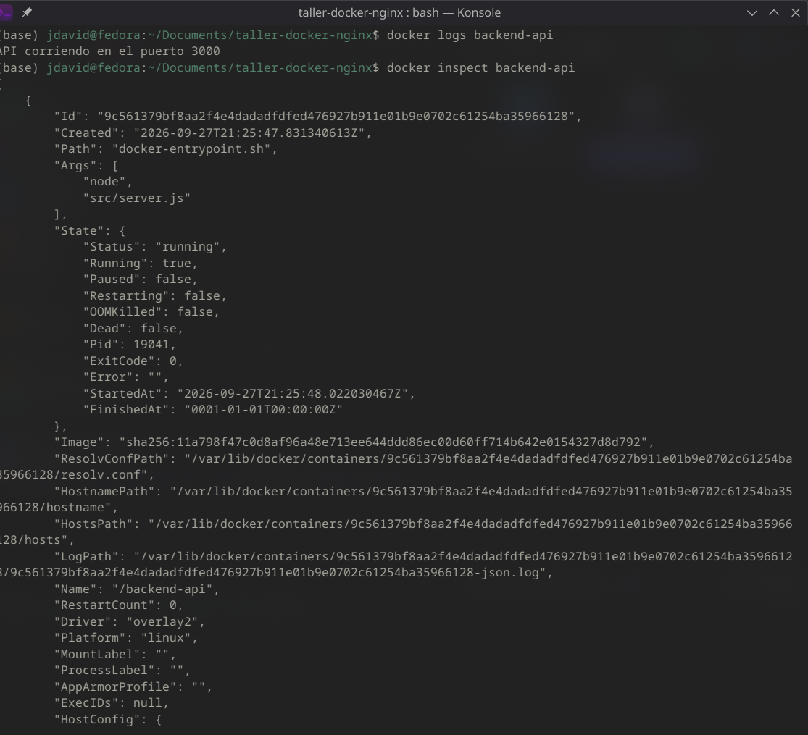

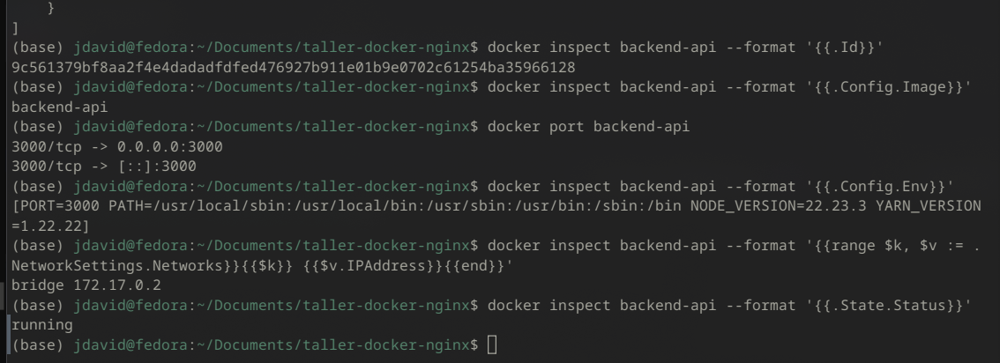

**¿Cuál es la diferencia entre el puerto del contenedor y el puerto publicado en el host?**

El puerto del contenedor es donde la app escucha adentro, en este caso el 3000 que le pasamos con `PORT`. El contenedor tiene su propia red, así que ese puerto no se ve desde afuera por sí solo. El puerto publicado es el del host, y Docker lo redirige al del contenedor con `-p host:contenedor`. Aquí los dos son 3000, pero no tienen que coincidir: con `-p 8081:3000` se entra por `localhost:8081` y la app sigue escuchando en el 3000 adentro.

## ports vs expose

`ports` publica el puerto en el host con el formato `host:contenedor`. Por eso al principio se podía entrar a la API por `localhost:3000`.

`expose` no publica nada en el host. Solo deja declarado que el contenedor usa ese puerto, y únicamente los demás contenedores de la red pueden llegar a él. Por eso Nginx sigue entrando a `api:3000`, pero desde el navegador ya no se puede.

En la práctica `expose` es más que todo documentación, porque los contenedores de una misma red se ven entre ellos igual. Lo que de verdad cierra el acceso es no poner `ports`. Por eso solo Nginx tiene `ports`.

## localhost vs nombre del servicio Docker

Cada contenedor tiene su propio network namespace, o sea, su propia red con su propio `localhost`. Dentro del contenedor de nginx, `localhost` es nginx mismo. La API está en otro contenedor con otra IP, así que `http://localhost:3000` no llega a ella.

Compose pone todos los servicios en la misma red, y Docker tiene un DNS interno (en `127.0.0.11`) que resuelve el nombre del servicio a la IP de su contenedor. Por eso `http://api:3000` sí funciona. Así tampoco hay que escribir IPs a mano, que además cambian cada vez que se recrea un contenedor.

## Evidencias de las pruebas

### API por Nginx y acceso directo bloqueado

```
$ curl http://localhost:8080/
{"name":"backend-api","version":"1.0.0","endpoints":["/health","/api/products","/api/products/:id"]}

$ curl http://localhost:8080/health
{"status":"ok","service":"backend-api"}

$ curl http://localhost:8080/api/products
[{"id":1,"name":"Teclado","price":80000},{"id":2,"name":"Mouse","price":45000},{"id":3,"name":"Monitor","price":650000}]

$ curl http://localhost:8080/api/products/1
{"id":1,"name":"Teclado","price":80000}
```

En el `docker compose ps` de la misma captura, la API sale solo con `3000/tcp`, sin `0.0.0.0:`, o sea que ya no está publicada en el host. Nginx es el único con `0.0.0.0:8080->8080/tcp`. El `80/tcp` de Nginx viene de un `EXPOSE 80` de la imagen oficial: está documentado, pero no publicado.

```
$ curl http://localhost:3000/health
curl: (7) Failed to connect to localhost port 3000 after 0 ms: Couldn't connect to server
```

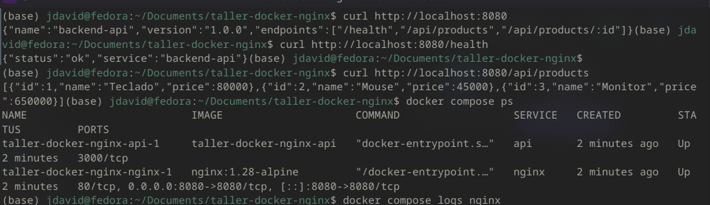

### Logs

En los logs de nginx sale una línea por cada request con código 200. La API solo imprime el mensaje de arranque, porque no loguea las peticiones.

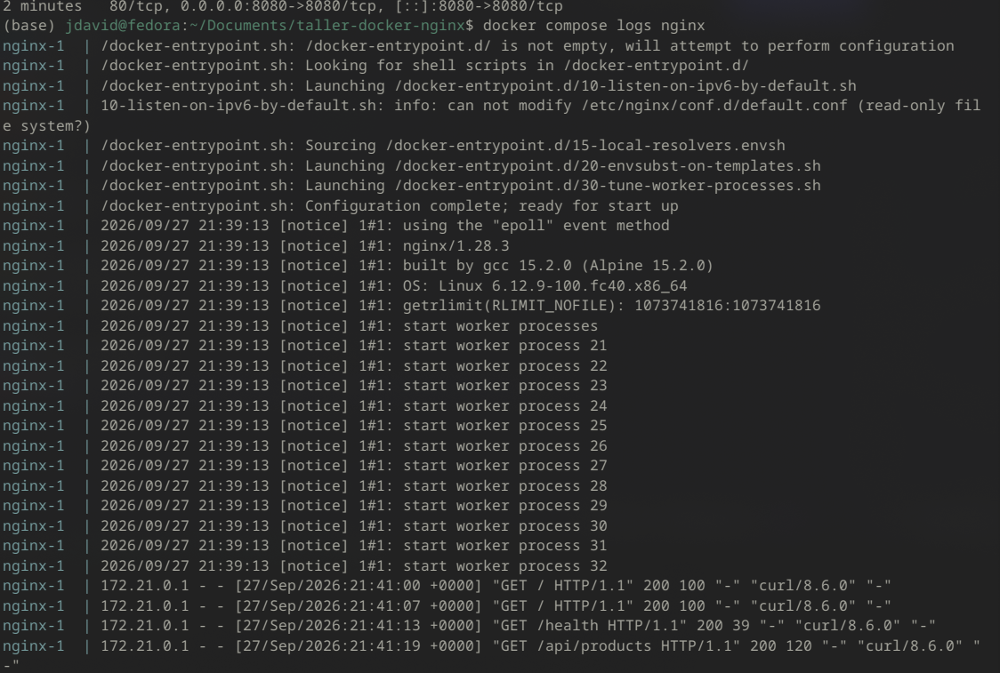

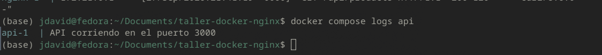

### Redis por nombre

Con Redis agregado quedan los tres servicios corriendo, y desde la API el nombre `redis` se resuelve con el DNS interno de Docker (`127.0.0.11`):

```
$ docker compose exec api nslookup redis
Server:         127.0.0.11
Address:        127.0.0.11:53

Name:   redis
Address: 172.21.0.2
```

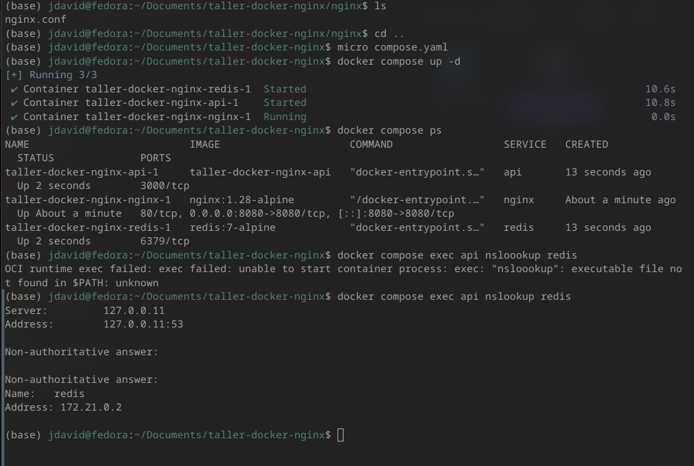

```
$ docker compose run --rm redis redis-cli -h redis ping
PONG

$ docker compose run --rm redis redis-cli -h localhost ping
Could not connect to Redis at localhost:6379: Connection refused
```

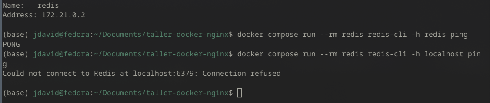

## Troubleshooting (Parte 9)

Cambiamos el `proxy_pass` a `http://localhost:3000` y reiniciamos.

**¿Qué error obtiene?**
Un `502 Bad Gateway`.

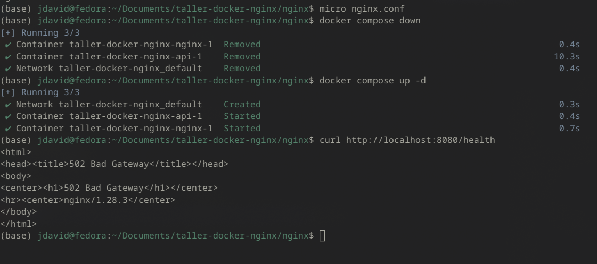

En `docker compose logs nginx` sale:

```
connect() failed (111: Connection refused) while connecting to upstream ... upstream: "http://[::1]:3000/health"
connect() failed (111: Connection refused) while connecting to upstream ... upstream: "http://127.0.0.1:3000/health"
```

Nginx intenta primero por IPv6 (`[::1]`) y luego por IPv4 (`127.0.0.1`), porque `localhost` resuelve a las dos. En ambos casos es el mismo contenedor de nginx.

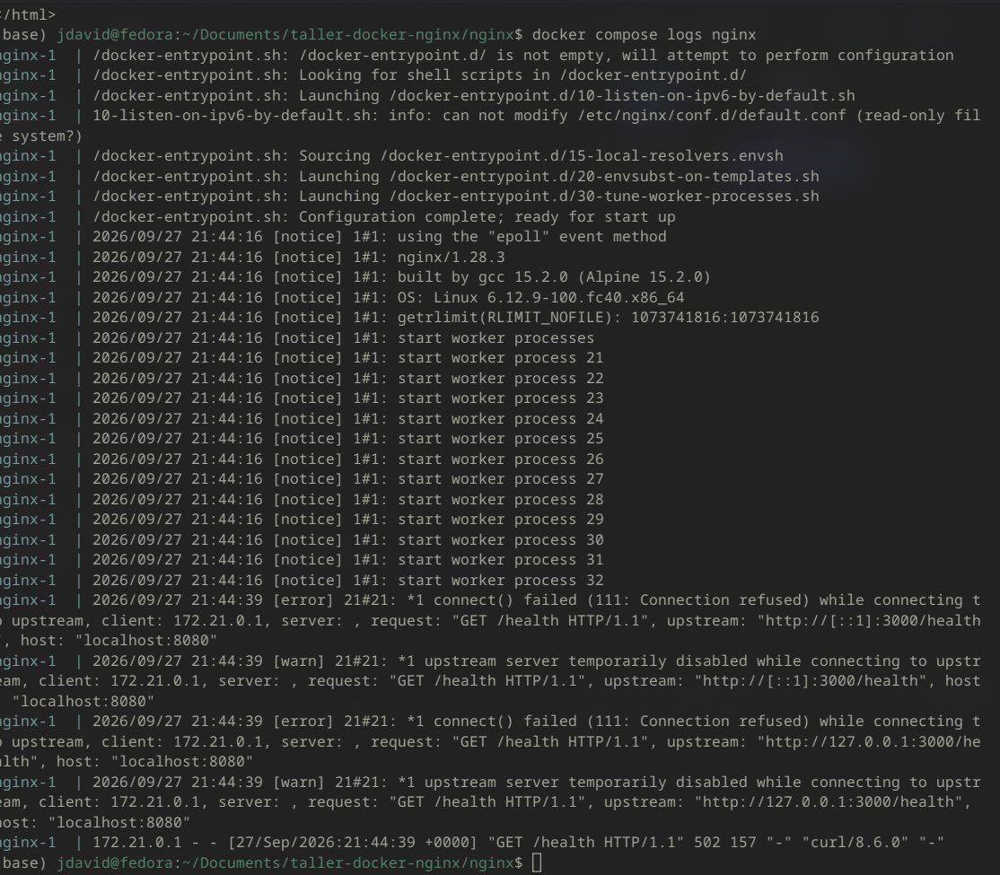

**¿Por qué ocurre?**
Nginx sí recibe la petición, pero al reenviarla a `localhost:3000` no hay nada escuchando ahí. El 502 significa eso: el proxy funciona, pero no pudo hablar con el servidor de atrás.

**¿Por qué localhost no representa al contenedor api?**
Porque `localhost` dentro del contenedor de nginx es el propio nginx, no la API, que está en otro contenedor con otra IP. Se ve claro desde adentro de nginx:

```
$ docker compose exec nginx wget -qO- http://localhost:3000/health
wget: can't connect to remote host: Connection refused

$ docker compose exec nginx wget -qO- http://api:3000/health
{"status":"ok","service":"backend-api"}
```

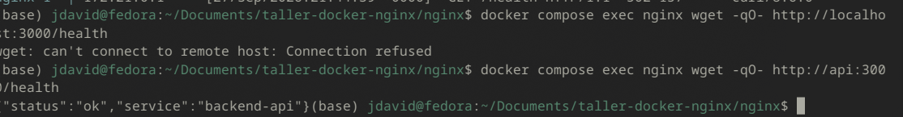

**¿Qué comando utilizaría para verificar las redes Docker?**
`docker network ls` para listarlas y `docker network inspect taller-docker-nginx_default` para ver qué contenedores están conectados y con qué IP.

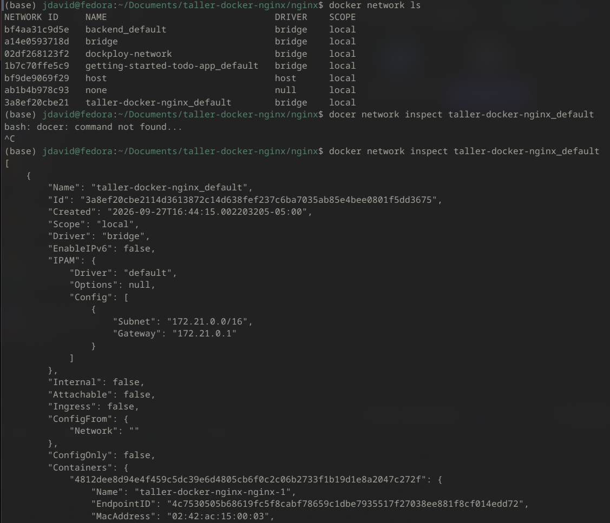

**¿Cómo solucionaría el problema?**
Volviendo a poner `proxy_pass http://api:3000;` y reiniciando los servicios. Después de eso `/health` vuelve a responder:

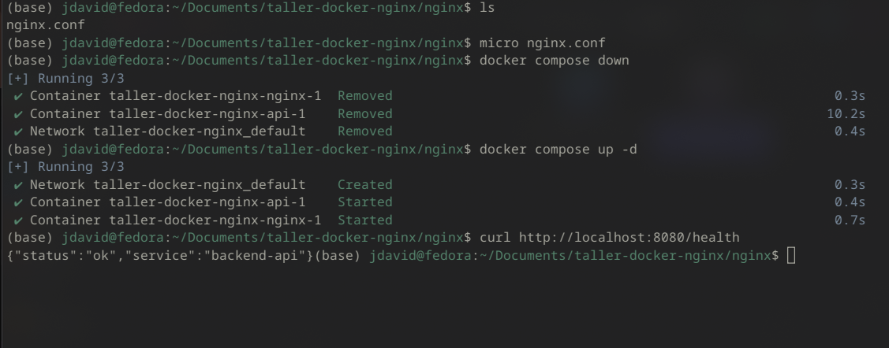